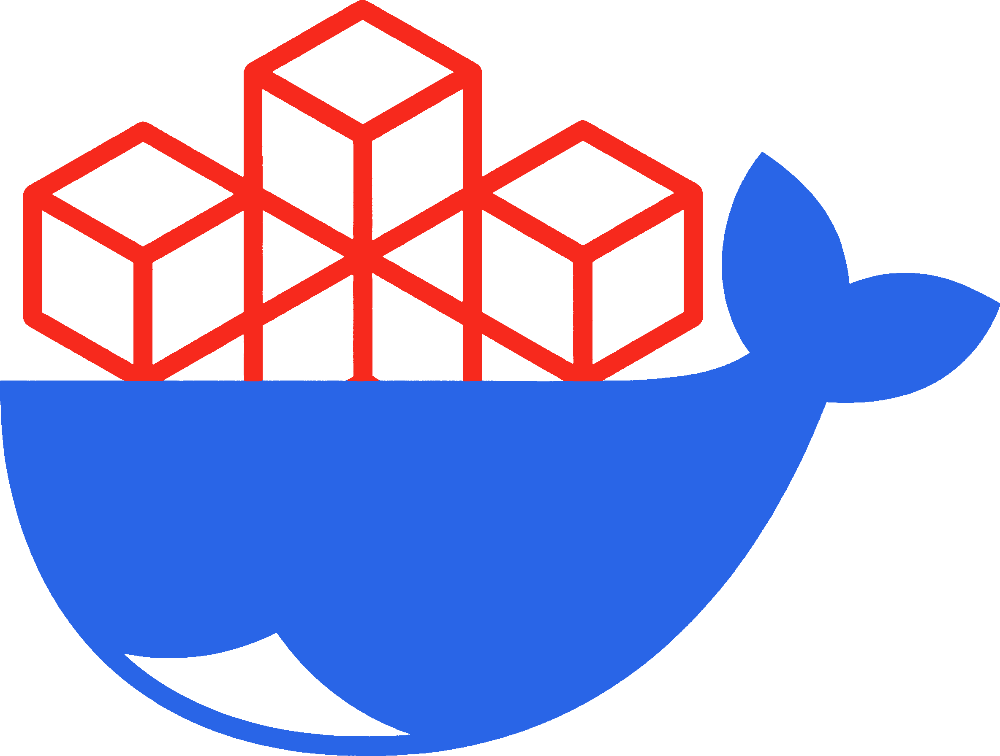

<p align="center">
  <a href="https://github.com/jonaaix/laravel-aio-docker">
    
  </a>
</p>

<h1 align="center">Laravel AIO Docker Image</h1>

<p align="center">
This all-in-one Docker runtime image is designed specifically for Laravel applications, providing a complete, pre-configured
environment that works seamlessly with any Laravel project. It streamlines setup and handles all essential configurations,
ensuring your Laravel application is ready to run out of the box with minimal effort.
</p>

<p align="center">
   <a href="https://github.com/jonaaix/laravel-aio-docker/pkgs/container/laravel-aio"></a>
   <a href="https://github.com/jonaaix/laravel-aio-docker/actions/workflows/build-and-push.yml"></a>
   <a href="./LICENSE"></a>
</p>

---

##### Laravel 12 & 13
###### PHP 8.5
- `ghcr.io/jonaaix/laravel-aio:1.3-php8.5-fpm`
- `ghcr.io/jonaaix/laravel-aio:1.3-php8.5-roadrunner`
- `ghcr.io/jonaaix/laravel-aio:1.3-php8.5-frankenphp`
- _openswoole is not compatible with PHP 8.5 yet_

##### Laravel 10 & 11
###### PHP 8.4
- `ghcr.io/jonaaix/laravel-aio:1.3-php8.4-fpm`
- `ghcr.io/jonaaix/laravel-aio:1.3-php8.4-roadrunner`
- `ghcr.io/jonaaix/laravel-aio:1.3-php8.4-frankenphp`
- `ghcr.io/jonaaix/laravel-aio:1.3-php8.4-openswoole`

#### Note:
When switching to a Laravel Octane based image (roadrunner/frankenphp/swoole) for the first time,
the entrypoint will automatically set up all requirements if not already available. 
You can commit the changes to your repository.

### Difference to Laravel Sail

This image relies exclusively on **native Docker tooling** and intentionally avoids additional abstraction layers or custom APIs. It gives developers **full control over build, runtime, and configuration**, without being constrained by predefined conventions. Development and production setups are based on the same image and are fully reproducible.


## Configuration

Configuration is managed via environment variables. All flags are **opt-in** (default: `false`).

### 1. Operation Mode
The system runs in **Production Mode** by default.

| Variable | Default | Description |
| :--- | :--- | :--- |
| `ENV_DEV` | `false` | Set to `true` to enable **Development Mode**. |

### 2. Development Features
> **Requirement:** Active only when `ENV_DEV=true`.

| Variable | Description |
| :--- | :--- |
| `DEV_FORCE_NPM_INSTALL` | Forces `npm install` on every container start. |
| `DEV_NPM_RUN_DEV` | Runs `npm run dev` (Vite) on container start. |
| `DEV_ENABLE_XDEBUG` | Enables Xdebug extension. |

### 3. Production Automation
> **Requirement:** Active only when `ENV_DEV=false` (default).

| Variable | Description |
| :--- | :--- |
| `PROD_RUN_ARTISAN_MIGRATE` | Runs `php artisan migrate --force` on boot. |
| `PROD_RUN_ARTISAN_DBSEED` | Runs `php artisan db:seed --force` on boot. |
| `PROD_SKIP_OPTIMIZE` | Skips standard Laravel caching/optimization commands. |

### 4. Background Services & System
Supervisor always runs, but specific workers are optional.

| Variable | Context | Description |
| :--- | :--- | :--- |
| `ENABLE_QUEUE_WORKER` | Worker | Starts the standard Laravel Queue Worker. |
| `ENABLE_HORIZON_WORKER` | Worker | Starts the Laravel Horizon process. |
| `SKIP_LARAVEL_BOOT` | System | **FPM only.** Skips Laravel boot (useful for non-Laravel PHP apps). |


**Check the examples directory for full example docker-compose configurations.**

A typical dev setup might look like this:
```yml
sevices:
   php:
      image: ghcr.io/jonaaix/laravel-aio:1.3-php8.5-fpm
      volumes:
         - ./:/app:rw
      environment:
         ENV_DEV: true
         DEV_NPM_RUN_DEV: true
         ENABLE_SUPERVISOR: true
         ENABLE_HORIZON_WORKER: true
      ports:
         - "8000:8000" # php
         - "5173:5173" # vite
```

## Project Directory Ownership
- The container runs as uid 1000, to match the host user on most systems.
- Your local project permissions may need to be reset to the correct defaults (1000:1000).

For a full reset of permissions, you can run the following command in your project directory:
```bash
docker compose exec --user root php sh -c "/scripts/fix-laravel-project-permissions.sh"
```
But on macOS the default group is `staff`, so you might need to run the following command afterwards:
```bash
sudo chown -R $(whoami):staff /path/to/app
```


## Xdebug
To enable xdebug, set `DEV_ENABLE_XDEBUG` to `true` in your `docker-compose.yml` file.
You can connect to the xdebug server on port `9003`.

<details>
<summary>PHPStorm Configuration (click to expand)</summary>

#### PHPStorm Configuration
1. Go to `Settings` -> `PHP` -> `Debug`
2. External Connections: **DISABLE** `Break at first line in PHP scripts`
3. Xdebug: **DISABLE** `Force break at first line when no path mapping specified`
4. Xdebug: **DISABLE** `Force break at first line when a script is outside the project`
5. Go to `Settings` -> `PHP` -> `Servers`
6. Add a new server with name "laravel" according to the docker-compose configuration:
   - Name: `laravel`
   - Host: `localhost`
   - Port: `8000`
   - Debugger: `Xdebug`
   - **ENABLE**: `Use path mappings`: `path/to/your/project` -> `/app`
7. Install [browser extension](https://www.jetbrains.com/help/phpstorm/browser-debugging-extensions.html) and enable it in the correct tab.
8. Activate telephone icon in PHPStorm to listen for incoming connections.
</details>


## Serving Javascript app with integrated nginx
Create a custom nginx.conf in your repository, and mount it in place of the default one.
Also, mount your javascript app in the `/my-app` directory.
```yml
services:
   php:
      volumes:
         - ./nginx.conf:/etc/nginx/http.d/default.conf
         - ../my-app:/js-app
```

In the config file, add the following location block (after `/basic_status`) to serve your javascript app.

<details>
<summary>nginx config for JS app serving (click to expand)</summary>

```nginx
####################################
####### Start serving JS app #######
####################################
location = / {
    return 301 $real_scheme://$http_host/app/;
}

location = /app {
    return 301 $real_scheme://$http_host/app/;
}

# Handle all SPA routes under /app/*
location ^~ /app/ {
    alias /js-app/;
    index index.html;

    # SPA fallback: this ensures /app/* routes always hit the frontend
    try_files $uri $uri/ /app/index.html;

    location ~* \.(?:manifest|appcache|html?|xml|json)$ {
        expires -1;
    }

    location ~* \.(jpg|jpeg|png|gif|ico|woff2?|otf|ttf|js|svg|css|txt|wav|mp3|aff|dic)$ {
        add_header Cache-Control "public, max-age=31536000, immutable";
        access_log off;
    }
}
####################################
####### End serving JS app #########
####################################
```
</details>  


## Custom scripts
You can hook into the boot process by mounting your custom script directories.
The scripts will be executed in alphabetical order.

```yml
services:
   php:
      volumes:
         - ./docker/before-boot:/custom-scripts/before-boot
         - ./docker/after-boot:/custom-scripts/after-boot
```

### Example docker-compose.yml for DEVELOPMENT
<details>
<summary>docker-compose.yml (click to expand)</summary>

```yaml
# WARNING: Make sure the project-folder-name is unique on your server!
# You should disable port-exposure in production!

volumes:
   db_volume:
      driver: local

services:
   php:
      container_name: ${APP_NAME}_php
      image: ghcr.io/jonaaix/laravel-aio:1.3-php8.5-fpm
      stop_grace_period: 60s
      volumes:
         - ./:/app
      environment:
         ENV_DEV: true
         DEV_NPM_RUN_DEV: true
         DEV_ENABLE_XDEBUG: true
         ENABLE_HORIZON_WORKER: true
      ports:
         - "8000:8000" # php
         - "5173:5173" # vite
      restart: unless-stopped
      depends_on:
         - mysql
         # - redis
      networks:
         - app

   mysql:
      container_name: ${APP_NAME}_mysql
      image: mariadb:lts
      # image: mysql:lts
      command:
         - '--character-set-server=utf8mb4'
         - '--collation-server=utf8mb4_unicode_ci'
         - '--skip-name-resolve' # Disable DNS lookups (not needed in Docker, improves performance)
      volumes:
         - db_volume:/var/lib/mysql/:delegated
      cap_add:
         - SYS_NICE # Allow the container to adjust process priority (optional for performance tuning)
      environment:
         # MySQL specific configuration
         # MYSQL_ALLOW_EMPTY_PASSWORD: 'false' # Disallow empty password
         # MYSQL_INITDB_SKIP_TZINFO: '1' # Skip loading DB time zone tables (improves performance)
         ### Database initialization ###
         MYSQL_ROOT_PASSWORD: ${DB_ROOT_PASSWORD}
         MYSQL_USER: ${DB_USERNAME}
         MYSQL_PASSWORD: ${DB_PASSWORD}
         MYSQL_DATABASE: ${DB_DATABASE}
      ports:
         - "3306:3306"
      restart: unless-stopped
```
</details>


### Adding Redis

To add Redis to your project, add the following service to your `docker-compose.yml` file:

```yml
volumes:
   redis_volume:
      driver: local

redis:
   container_name: ${APP_NAME}_redis
   image: redis:7-alpine
   volumes:
      - redis_volume:/data
   command: [ "redis-server", "--requirepass", "${REDIS_PASSWORD}" ]
   ports:
      - "6379:6379"
   restart: unless-stopped
   networks:
      - app
```

### Adding Chromium PDF

Chromium is included in the `1.3` images, so you can use it to generate PDFs in your Laravel application.

Install the package `spatie/laravel-pdf` and configure it to use the `chrome` driver.

```shell
composer require spatie/laravel-pdf
npm install -S puppeteer
```

```php
<?php

namespace App\Services;

use Spatie\Browsershot\Browsershot;
use Spatie\LaravelPdf\PdfBuilder;

class PDF {
   /**
    * Get printer instance
    */
   public static function getPrinter(): PdfBuilder {
      return \Spatie\LaravelPdf\Support\pdf()->withBrowsershot(function (Browsershot $browsershot) {
         $browsershot->setOption('executablePath', '/usr/bin/chromium-browser');
      });
   }
}

```


### Adding PhpMyAdmin
```yaml
pma:
   container_name: ${APP_NAME}_pma
   image: phpmyadmin:latest
   environment:
      PMA_HOST: mysql
      PMA_PORT: 3306
      APACHE_PORT: 8080
      UPLOAD_LIMIT: 1G
   restart: unless-stopped
   depends_on:
      - mysql
   networks:
      - default
      - main-proxy
```

### Debugging nginx configuration
You can print all variables by adding this location in your `nginx.conf` file.
<details>
<summary>nginx config (click to expand)</summary>

```nginx
 location /debug_status {
     default_type text/plain;
     return 200 "
         scheme: $scheme
         host: $host
         server_addr: $server_addr
         remote_addr: $remote_addr
         remote_port: $remote_port
         request_method: $request_method
         request_uri: $request_uri
         document_uri: $document_uri
         query_string: $query_string
         status: $status
         http_user_agent: $http_user_agent
         http_referer: $http_referer
         http_x_forwarded_for: $http_x_forwarded_for
         http_x_forwarded_proto: $http_x_forwarded_proto
         request_time: $request_time
         upstream_response_time: $upstream_response_time
         request_filename: $request_filename
         content_type: $content_type
         body_bytes_sent: $body_bytes_sent
         bytes_sent: $bytes_sent
         connection: $connection
         connection_requests: $connection_requests
         server_protocol: $server_protocol
         server_port: $server_port
         request: $request
         args: $args
         time_iso8601: $time_iso8601
         msec: $msec
         uri: $uri
     ";
 }
```
</details>
